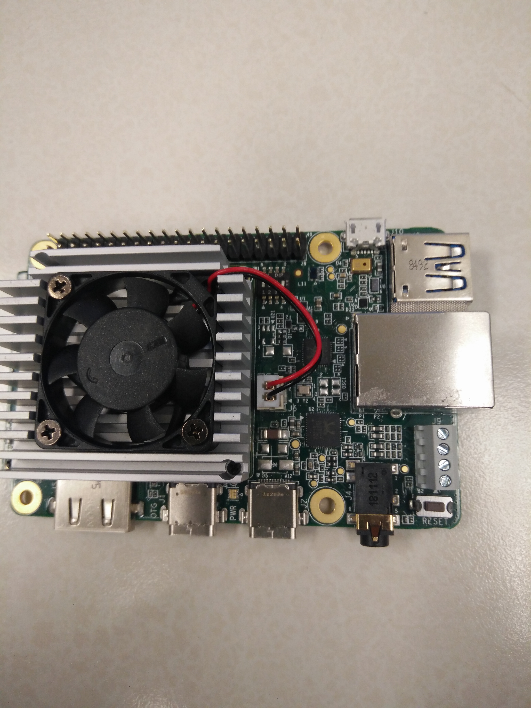
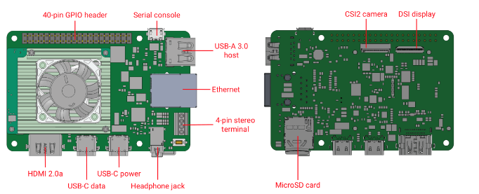
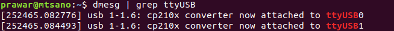
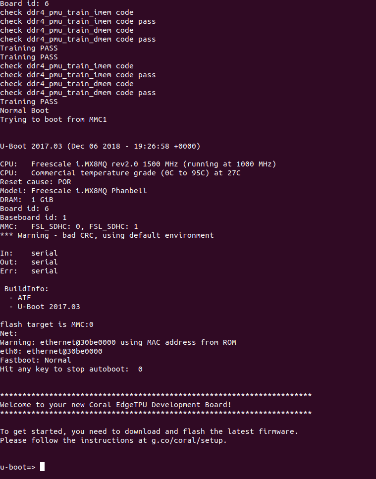

# Playing with Google Coral

I got hands on to a Google Coral development board. Please check it out at this [link](https://coral.withgoogle.com/products/dev-board/). The first step would be to study the getting started guide for the board. The official page at this [link](https://coral.withgoogle.com/tutorials/devboard/).

This document describes the steps that I followed from the official link, but is re-written for my own convenience so that in future I can refer to this document. The content are derived from the Google official page at this [link](https://coral.withgoogle.com/tutorials/devboard/).

## Looks
This is how it looks. The images are of the ones that I had with me.

## Getting Started
The getting started guide wants us to boot through a linux machine rather than using SD card directly to the board. So, that is the way I am going to follow. So the booting method would be **emmc**, rather than SD card. 

Before we move forward, I suppose following image will be vital in shaping our understanding of the board.

From the above figure, note that the board has two USB-C connectors of which one is for data and another is for power. There is a USB-microB port for serial console. The 40-pin GPIO provides immense power to the user to use it for industrial control system or other automation tasks. HDMI port and USB A connector allow it to be connected to monitor and keyboard to be used as a desktop too.

## Configuring
Please make sure you have following connectors with you at this moment before moving on.
1. Since we will be using terminal to access (following Google tutorial) the board, we will need a **linux machine**
2. A **USB-A to USB-microB** cable to connect to the serial port of cable. Please refer to the image above to find  the serial port of the cable
3. A **USB-A to USB-C** cable to connect the PC to the boards data port.
4. A **USB Type C** power supply (Google site mentions it to be as a phone charger)
5. An ethernet cable or wifi connection

Following are the steps that I followed:
1. First install `screen` in your linu machine
`sudo apt-get install screen`
2. Find the boot mode switches. They are four switches that are marked 1,2,3,4. Make sure that Switch 1 is ON while all other switches are OFF. (ON means they are pulled upwards)
3. In your terminal in Linux machine, type in following command. This will enable the computer to recognize the board.
sudo sh -c "echo 'SUBSYSTEM==\"usb\", ATTR{idVendor}==\"0525\", MODE=\"0664\",GROUP=\"plugdev\", TAG+=\"uaccess\"' >> /etc/udev/rules.d/65-edgetpu-board.rules"
`sudo udevadm control --reload-rules && udevadm trigger`

4. Connect to the serial terminal. It is where the USB-microB cable fits in. Two leds, one green and one orange will light up.
5. Search for the device name in terminal. Type in `dmesg | grep ttyUSB`. You will get the result as follows:
.
6. Note the output in your terminal from pervious operation.The USB device listed first will be the one that we will connect and open the serial console connection.
`screen /dev/ttyUSB0 115200` The `dev/ttyUSB0` selects the device and `115200` is the baud rate. After this command, the complete screen in terminal should be blank.
*I was getting [screen is terminating] mesages for sometime, but typing the command as sudo fixed the issue*
7. Let us power the board now. Plug in the power cable to the USB-C power port. Please refer to the image above. This will turn the fan on and  the Red led on. This will also print messages in the screen  terminal like below with u-boot prompt.

8. Execute the command `fastboot 0`. This will make the fastboot wait for host to begin flashing.
9. Plug in the USB-C connector to the Data port in the board. (It should be right next to the Power USB-C port). This is the connection used by fastboot. 
10. Let us verify that the connection is proper. Open a new terminal, and type `fastboot devices`. If fastboot is not installed, you can install it. It should print the device ID of the connected device. Please check the connection if it doesnot.
11. Now download the image using the following commands. Use a new terminal. (Do not use the terminal connected to the device or the screen terminal).
`wget https://dl.google.com/aiyprojects/mendel/enterprise/mendel-enterprise-beaker-22.zip`
12. Its a zipped file, so let us extract the content.
`unzip mendel-enterprise-beaker-22.zip && cd mendel-enterprise-beaker-22`
13. Let us flash it by running `flash.sh`. This will print a series of outputs on both the terminal screens while flashing the device. After finishing the operation, it will reboot the device itself.
14. After all done, it should prompt for username and password. Please supply following values in the screen terminal.
`login: mendel`
`password: mendel`
In my case, it did not prompt for the login  until I hit `Enter`.
15. This gives access to the board terminal.
##Internet
This first thing to do is to connect to the internet. So I plugged in a LAN connection. The device detected the connection and printed some specifications in the terminal. But you can connect it to WiFi also.`ifconfig` does not work so use `ip addr` instead.

You can use SSH connection to connect to it. After SSH is connected, remove the serial cable connection (microB-USB port).

